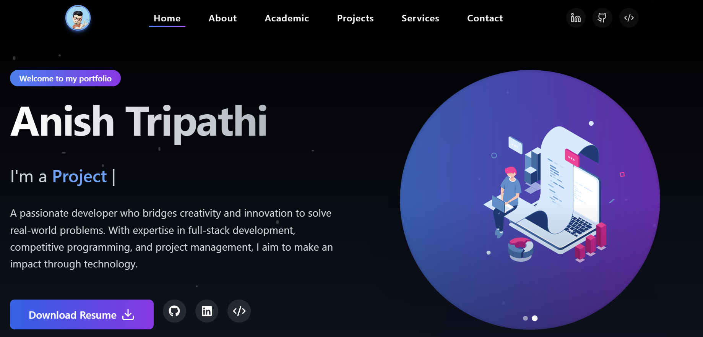
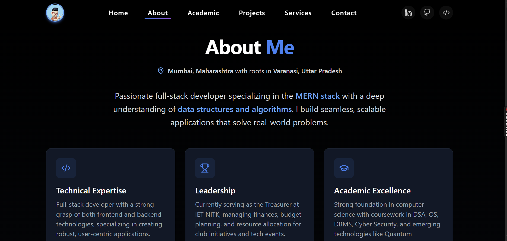
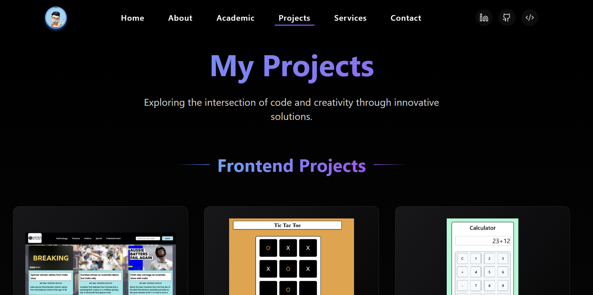

# Anish Tripathi - Portfolio

## 👋 About Me

I'm a passionate **Full-Stack Developer** and **Competitive Programmer** currently pursuing BTech in Electronics and Communication Engineering with a minor in Computer Science at NITK. I specialize in building robust web applications and solving complex algorithmic challenges.

🔹 **Tech Enthusiast** | 🔹 **Problem Solver** | 🔹 **Open Source Contributor**

---

## 🧠 Skills

### 👨‍💻 Programming Languages

- C, C++
- JavaScript
- Python

### 🤩 Frontend Technologies

- React.js
- Nextjs
- Tailwind CSS
- HTML5, CSS3

### 🔧 Backend Technologies

- Node.js
- Express.js
- MongoDB, SQL, Firebase, Supabase

### 🤖 GenAI & Modern Tools

- LangChain, Pinecone, FastAPI, RAG (Retrieval Augmented Generation)

---

## 🚀 Major Projects

### 🔄 SwapStay: Student Room Exchange System

**Stack:** MERN, Socket.IO, Stripe, JWT, Firebase

- Role-based access and OTP activation
- Real-time room swap requests
- Mess and guest house booking
- Chat and notification system
- Stripe-based payment

### 👫 ClubMate: Campus Connect

**Stack:** MERN, WebSockets

- Role-based access control
- Centralized event management
- Automated recruitment system

### 🍽️ DineSmart: Smart Restaurant Platform

**Stack:** React, Firebase, Express, MongoDB

- Role-based dashboard for Admin, User & Restaurant
- Real-time order tracking and table booking
- Google OAuth, OTP Auth
- Secure payments, smart filters, nutritional info

---

## 🖼️ Portfolio Snapshots

### 🏠 Home Page

### 🏠 Home

<i>Welcome to the landing page – your journey starts here!</i>

---

### 🙋 About Me

<i>Get to know me, my journey, and my passions.</i>

---

### 🎓 Academic Details

<i>Explore my academic background and coursework.</i>

---

### 🚀 Projects

<i>Dive into some of my most impactful creations!</i>

---

## 🏆 Achievements

- Certified in **Postman API**, **MERN stack**, and **AlgoUniversity Graph Camp**
- **Treasurer at IET NITK** managing ₹1.5L+ budget
- Organized **RoboWar** with 100+ participants
- Conducted **8+ technical workshops** for juniors
- **Leetcode** enthusiast ([Profile](https://leetcode.com/u/AnishTripathi/))

---

## 🔗 Let's Connect

- [LinkedIn](https://www.linkedin.com/in/anish-t-223238270/)
- [GitHub](https://github.com/yourusername)
- [LeetCode](https://leetcode.com/u/AnishTripathi/)
- [Portfolio](https://portfolio-sandy-nine-48.vercel.app/)

📧 **Email:** tripathiarun780@gmail.com  
📞 **Phone:** +91 9867469877
